<picture>
  <source media="(prefers-color-scheme: dark)" srcset="https://capsule-render.vercel.app/api?type=waving&height=220&section=header&text=Shalini%20Kashaboina&fontSize=52&fontColor=FFFFFF&fontAlignY=38&desc=2nd-Year%20Undergraduate%20%7C%20Python%20Developer%20%7C%20Full%20Stack%20Learner&descSize=18&descAlignY=62&animation=fadeIn&color=gradient&customColorList=0,12,20">
  <source media="(prefers-color-scheme: light)" srcset="https://capsule-render.vercel.app/api?type=waving&height=220&section=header&text=Shalini%20Kashaboina&fontSize=52&fontColor=FFFFFF&fontAlignY=38&desc=2nd-Year%20Undergraduate%20%7C%20Python%20Developer%20%7C%20Full%20Stack%20Learner&descSize=18&descAlignY=62&animation=fadeIn&color=gradient&customColorList=0,12,20">
  
</picture>

# Hey there, I'm Shalini 👋

 

---

## 👩‍💻 About Me

<table>
<tr>
<td width="65%" valign="middle">

I'm a **2nd-year undergraduate** interested in software development, problem solving, and building practical web applications.

- 💻 Learning **Python, Full Stack Development & JavaScript**
- 🧠 Practicing **DSA** on LeetCode and HackerRank
- 🚀 Interested in **AI, web development and modern developer technologies**
- 📚 Completed **Python Full Stack** training through Infosys Springboard
- 🛠️ Building academic, personal and hackathon-oriented projects
- 🎯 Working toward strong internship and software-development opportunities

I enjoy turning ideas into useful applications while continuously improving my coding, problem-solving, and development skills.

</td>
</tr>
</table>

---

## 🛠️ Tech Stack

### 💻 Languages

### 🎨 Frontend

### ⚙️ Backend & APIs

  

### 🗄️ Databases

### ☁️ Tools & Platforms

### 🧩 Problem Solving

  
  

---

## 🚀 Featured Projects

<table>
<tr>

<td width="33%" valign="top">

### 📚 Learning Management System

A web-based learning platform designed to organize learning content and provide a simple student-focused experience.

  

</td>

<td width="33%" valign="top">

### 🤖 AI Resume Analyzer

An AI-focused project concept for analyzing resumes, identifying suitable technical roles, and suggesting a personalized learning path.

  

</td>

<td width="33%" valign="top">

### 🏧 Python ATM Simulation

A Python project implementing PIN verification, balance checking, deposits, withdrawals, PIN changes, and exit functionality.

  

</td>

</tr>
</table>

---

## 📜 Certifications & Learning

| Area | Details |
|:---:|:---|
| 🐍 **Python** | Python Full Stack Course — Infosys Springboard |
| 🧩 **DSA** | Practicing Data Structures & Algorithms |
| 💻 **Web Development** | HTML, CSS, JavaScript & Full Stack Fundamentals |
| ☁️ **Cloud** | Exploring AWS & Cloud Fundamentals |
| 🤖 **AI** | Exploring Generative AI and AI-powered applications |

---

## 📊 GitHub Statistics

  

---

## 🐍 Contribution Snake

<picture>
  <source media="(prefers-color-scheme: dark)" srcset="./profile/github-snake-dark.svg">
  <source media="(prefers-color-scheme: light)" srcset="./profile/github-snake.svg">
  
</picture>

---

# 🧠 Currently Learning

| Focus Area | Current Focus |
|:---:|:---|
| 🧩 **DSA** | Data Structures, Algorithms & Problem Solving |
| 🐍 **Python** | Problem Solving & Full Stack Development |
| 🌐 **Web Development** | Frontend, Backend & REST APIs |
| 🤖 **AI** | Generative AI & AI-powered applications |
| ☁️ **Cloud** | AWS & Cloud Fundamentals |

---

# 🎯 Career Goals

<table>
<tr>
<td>

- Strengthen my DSA and problem-solving skills
- Build practical full-stack applications
- Prepare for software-development internships
- Participate in hackathons and developer communities
- Learn modern AI and cloud technologies
- Grow into a strong software engineer

</td>
</tr>
</table>

---

# 🤝 Connect With Me

  

  <strong>Learn • Build • Solve • Grow 🚀</strong>

---

